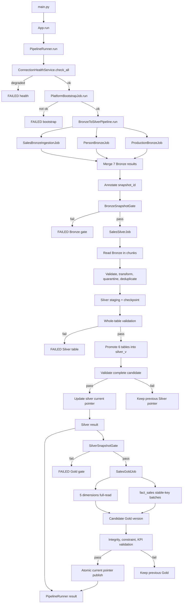

# AdventureWorks Analytics Platform

AdventureWorks Analytics Platform is a medallion-style data platform built to bring AdventureWorks data from the source system into a warehouse, clean and standardize it, create analytical tables, and serve revenue and sales performance reporting.

The important part of this repository is not limited to the Bronze, Silver, and Gold tables. After the 4A, 4B, 4C, and 4D refactors, the system also has a shared platform layer for configuration, connections, identity, retries, auditing, checkpoints, staging, quarantine, validation, and publication. This allows pipelines to fail safely, rerun in a controlled way, and preserve the latest known-good data version.

## System Story

Initially, the application had a thin entry point and several jobs tightly coupled to Sales logic. As the scope expanded, the system was separated into three clear areas:

```text
src/app/       orchestration and pipeline gates
src/features/  domain-specific business logic
src/shared/    shared ingestion infrastructure
src/core/      settings and minimal compatibility shells
```

The post-refactor principle is: **features use shared infrastructure; shared infrastructure does not depend on specific features**. Therefore, Sales, Person, and Production can own their own jobs while sharing a consistent set of contracts and operational mechanisms.

### 4A - Foundation

Phase 4A established the rules used by every subsequent layer:

- `pydantic-settings` centralizes configuration and hides secrets.
- `TableSpec` describes the source, target, primary key, required columns, and ordering key.
- The result model standardizes status, identity, row counts, timing, and errors.
- Retry, staging, audit, quarantine, and checkpoint capabilities became injectable services.
- Domain ownership was separated into Sales, Person, and Production.

From this point on, orchestration no longer needs to know connection details or how each batch is written. It only coordinates components through contracts.

### 4B - Bronze Becomes a Controlled Landing Zone

Bronze receives raw data from SQL Server AdventureWorks2012. The three domain jobs run through the same shared mechanisms:

| Domain job | Bronze targets |
|---|---|
| Sales | `sales_order_header`, `sales_order_detail`, `customer`, `sales_territory`, `sales_person` |
| Person | `person` |
| Production | `product` |

Each table is read by stable ordering key and batch. Data passes through run/load-specific staging, receives lineage metadata, records audit/checkpoint information, quarantines rejected rows, and retries transient failures. Data is published to Bronze only after all staging data passes validation.

If a batch or run fails, reconciliation and deterministic identity allow the system to identify what has already been committed instead of blindly appending. The currently published Bronze data is not deleted until the new version has completed validation.

### 4C - Silver Turns Raw Data into an Analytical Source

After all seven Bronze targets belong to the same `snapshot_id` and pass `BronzeSnapshotGate`, Silver runs in a fixed dependency order:

```text
sales_order_header
sales_order_detail
customer
sales_territory
product
sales_person
```

Silver reads Bronze in chunks, checks the schema, converts data types, runs business cleaners, quarantines conversion errors, checks grain and primary keys, deduplicates full tables, and validates before publication. `bronze.person` is required to enrich `sales_person`.

Silver produces six standardized tables:

```text
silver.sales_order_header_clean
silver.sales_order_detail_clean
silver.customer_clean
silver.sales_territory_clean
silver.product_clean
silver.sales_person_clean
```

Silver is considered ready for Gold only when all six tables have been published and share the same `source_snapshot_id`.

### 4D - Gold Becomes a Safe Analytical Layer

Gold builds a star schema with five dimensions and one fact:

```text
gold.dim_date
gold.dim_customer
gold.dim_product
gold.dim_territory
gold.dim_salesperson
gold.fact_sales
```

Small dimensions are read in full. `fact_sales` is read in stable-key batches using `sales_order_detail_id`, ensuring one row per sales order detail. Before publication, Gold checks:

- schema, types, and metadata;
- primary keys, nullability, and uniqueness;
- fact grain and orphan references;
- measure formulas;
- KPIs against the Silver baseline, with a default tolerance of 2%;
- PK/FK constraints on the candidate schema.

Gold does not write directly to the version currently serving consumers. A candidate is built in a separate schema/version, after which the current pointer is updated atomically. If building, validation, constraints, KPIs, or publication fails, the previous Gold version continues serving data.

## Current Workflow

The application's canonical path is:

```text
main.py
  -> App.run()
  -> PipelineRunner.run(mode="full")
  -> ConnectionHealthService
  -> PlatformBootstrapJob
  -> BronzeToSilverPipeline
       -> SalesBronzeIngestionJob
       -> PersonBronzeJob
       -> ProductionBronzeJob
       -> BronzeSnapshotGate
       -> SalesSilverJob
  -> SalesGoldJob
```

In the current wiring, `App` registers `PostgresSilverPublishService` for Silver and creates the production `SalesGoldJob` from PostgreSQL Gold adapters. `PipelineRunner` receives the Gold job through dependency injection and invokes Gold only after Bronze/Silver succeeds. Therefore:

- `main.py` requires all three stages: Bronze, Silver, and Gold;
- Silver must publish all six real targets to PostgreSQL before Gold reads them;
- Gold checks `SilverSnapshotGate`, builds a candidate, validates it, and then publishes atomically;
- if Silver or Gold fails, the top-level result returns `status=FAILED` and the corresponding `failed_stage`;
- a live Bronze -> Silver -> Gold run requires SQL Server, PostgreSQL, and the required schema/runtime adapters.

The Gold implementation and stage are now connected to the application entry point. Before publication, Gold maintains the fail-closed principle and does not change the serving version if the candidate does not pass.

## Data Results by Layer

| Layer | Role | Result |
|---|---|---|
| Bronze | Raw landing with audit and lineage | Source data, run/load staging, rejected-record evidence, and retry-safe publication |
| Silver | Cleaning and standardization | Six analytical source tables with snapshot identity |
| Gold | Analytical model | Five dimensions, `fact_sales`, KPIs, and versioned publication |
| Dashboard | Consumption/reporting | Sales performance reporting from analytical output |

## Dashboard

The dashboard is the final data consumption layer. It presents Sales Performance metrics to business users based on analytical tables validated in Silver/Gold.


## Workflow overview




## Repository Structure

```text
src/
├── app/                 # orchestration, pipeline runner, and snapshot gates
├── core/                # settings and compatibility shells
├── shared/              # connectors, ingestion contracts, and shared services
├── features/
│   ├── Sales_Performance/ # Sales Bronze/Silver/Gold and domain logic
│   ├── Person/            # Person Bronze ownership
│   └── Production/        # Product/Production Bronze ownership
└── utils/               # logging and helper utilities

scripts/
├── source/              # extraction/profiling from the source system
├── ingestion/           # operational ingestion wrappers
├── transformation/      # Silver transformations
└── warehouse/           # PostgreSQL schema, DDL, and Gold adapters

tests/                   # contract, unit, and integration-oriented tests
docs/                    # architecture, execution evidence, and project notes
notebooks/               # exploratory and analytical notebooks
Dashboard/               # dashboard assets and preview image
docker-compose.yml       # local PostgreSQL warehouse
main.py                  # application entry point
requirements.txt         # Python dependencies
```

## Configuration and Runtime

Settings are defined in [src/core/settings.py](src/core/settings.py), use `pydantic-settings`, and read `.env` and case-insensitive environment variables. Important defaults:

```text
SQL Server: localhost:1433 / AdventureWorks2012 / Windows authentication
PostgreSQL: localhost:5432 / adventureworks_warehouse
batch_size: 10000
retry_max_attempts: 3
silver_rejected_threshold: 0
silver_transform_version: silver-v1
```

PostgreSQL is provisioned by `docker-compose.yml` and initializes the `bronze`, `bronze_staging`, `silver`, and `gold` schemas along with metadata tables. Docker Compose does not provision SQL Server or the source AdventureWorks database.

An important operational detail: some PostgreSQL-backed services may initialize the ingestion schema in their constructor. PostgreSQL must therefore be ready before creating the default `App`.

## Running the Application

Use the repository-local Python environment:

```powershell
cd "A:\Workspace\DataEngineer\AdventureWorks Analytics Platform"
.\.venv\Scripts\Activate.ps1
```

Run the application:

```powershell
python main.py
```

Prerequisites:

- Python 3.11 environment in `.venv`;
- a running PostgreSQL warehouse;
- SQL Server with the `AdventureWorks2012` database;
- ODBC Driver 17 for SQL Server;
- an `.env` configuration appropriate for the host.

## Testing

Run the full regression suite:

```powershell
python -m pytest -q
```

The main test groups cover:

- settings and architecture contracts;
- Bronze extraction, staging, audit, quarantine, retry, checkpoint, and publication;
- Silver transformation, rejection, deduplication, and publication gating;
- Gold builders, fact grain, validation, KPIs, constraints, retries, reruns, and publication preservation;
- connector and PostgreSQL integration behavior when the database environment is available.

## Validation Status

- Phase 4A foundation: implemented.
- Phase 4B Bronze runtime: implemented with persistent audit/quarantine, staging, retry/reconciliation, and atomic publication.
- Phase 4C Silver runtime: implemented with chunked deterministic processing, validation, deduplication, checkpoints, and a publication gate.
- Phase 4D Gold runtime: implemented with an injectable job, Silver snapshot gate, candidate staging, integrity/KPI validation, constraint verification, and atomic publication.
- Gold focused tests: 52 tests based on the available evidence.
- Repository regression: 183 tests in the latest validation run.

## Related Documentation

- [Architecture refactor summary](ARCHITECTURE_REFACTOR_SUMMARY.md)
- [Phase 4A execution plan](docs/project/PHASE_4A_FOUNDATION_EXECUTION_VI.md)
- [Phase 4B Bronze execution spec](docs/internal/phase4b_bronzelayer_execution_spec.md)
- [Phase 4C Silver execution spec](docs/internal/phase4c_silverlayer_execution_vi.md)
- [Phase 4D Gold execution spec](docs/internal/phase4d_goldlayer_execution_vi.md)
- [Working standards](docs/internal/WORKING_STANDARDS.md)

## Notes

This repository is independent of the workspace-level legacy Python directory. The remaining compatibility shells only support old imports and entry points; the current source of truth is in `src/app`, `src/shared`, and `src/features`.
