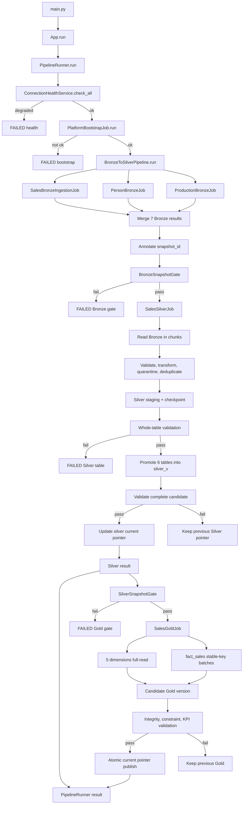

# AdventureWorks Analytics Platform

AdventureWorks Analytics Platform is an **end-to-end data platform** built on the **Medallion architecture (Bronze → Silver → Gold)**. It moves data from SQL Server AdventureWorks2012 into a PostgreSQL warehouse, cleans and standardizes it, builds an analytical model, and serves Sales Performance reporting.

In addition to the Bronze, Silver, and Gold layers, the system includes a **shared platform layer** used across the pipeline: configuration, connections, identity, retries, auditing, checkpoints, staging, quarantine, validation, and publication. This allows the pipeline to fail safely, rerun in a controlled manner, and preserve the last known-good data snapshot.

> **Core design principle:** Features use shared infrastructure; shared infrastructure does not depend on any specific feature.

---

## Tech Stack

| Component | Technology |
|---|---|
| Language | Python 3.11 |
| Source DB | SQL Server + AdventureWorks2012 |
| Warehouse | PostgreSQL 5432 |
| ORM / DB | SQLAlchemy 2.0, pyodbc, psycopg2 |
| Data processing | Pandas, NumPy, PyArrow |
| Configuration | pydantic-settings |
| Testing | pytest, pytest-cov |
| Code quality | Black, Flake8, MyPy, pylint, isort |
| Infrastructure | Docker Compose (PostgreSQL) |
| Reporting | Power BI |

---

## Medallion Architecture

```text
Source (SQL Server — AdventureWorks2012)
    ↓  Extract
Bronze Layer   — raw data + audit / lineage / staging / quarantine
    ↓  Validate & Clean
Silver Layer   — 6 standardized tables with snapshot identity
    ↓  Model
Gold Layer     — star schema: 5 dimensions + fact_sales
    ↓
Dashboard      — Sales Performance reporting (Power BI)
```

| Layer | Role | Outcome |
|---|---|---|
| Bronze | Raw landing with audit and lineage | Source data, per-run staging, rejected records, retry-safe publication |
| Silver | Cleaning and standardization | 6 clean analytical tables with snapshot identity |
| Gold | Analytical model | 5 dimensions, `fact_sales`, KPI validation, versioned publication |
| Dashboard | Consumption / reporting | Sales Performance reporting from analytical output |

---

## System Story

Initially, the application had only a thin entry point and jobs tightly coupled to Sales logic. As the scope expanded, the system was divided into three clearly defined areas:

```text
src/app/       — orchestration and pipeline gates
src/features/  — domain-specific business logic
src/shared/    — shared ingestion infrastructure
src/core/      — settings and minimal compatibility shells
```

### Phase 4A — Foundation

- `pydantic-settings` centralizes configuration and keeps secrets out of code.
- `TableSpec` describes the source, target, primary key, required columns, and ordering key.
- The result model standardizes status, identity, row counts, timing, and errors.
- Retry, staging, audit, quarantine, and checkpoint capabilities are injectable services.
- Domain ownership is separated into Sales, Person, and Production.

### Phase 4B — Bronze: Controlled Landing Zone

Bronze receives raw data from SQL Server AdventureWorks2012 through three domain jobs:

| Domain Job | Bronze targets |
|---|---|
| `SalesBronzeIngestionJob` | `sales_order_header`, `sales_order_detail`, `customer`, `sales_territory`, `sales_person` |
| `PersonBronzeJob` | `person` |
| `ProductionBronzeJob` | `product` |

Each table is read in batches using a stable ordering key. Data passes through per-run/load staging, receives lineage metadata, records audit/checkpoint information, quarantines rejected rows, and retries transient failures. Data is published to Bronze only after all staging data passes validation. If a failure occurs, reconciliation and deterministic identity identify what has already been committed without blindly appending duplicates.

### Phase 4C — Silver: Raw Data → Analytical Source

Once all 7 Bronze targets share the same `snapshot_id` and pass `BronzeSnapshotGate`, Silver runs in a fixed dependency order:

```text
sales_order_header → sales_order_detail → customer
→ sales_territory → product → sales_person
```

Silver reads Bronze in chunks, checks schemas, converts data types, runs business cleaners, quarantines conversion errors, checks grain/primary keys, deduplicates each full table, and validates the results before publication. `bronze.person` is required to enrich `sales_person`.

**Output — 6 clean tables:**

```text
silver.sales_order_header_clean
silver.sales_order_detail_clean
silver.customer_clean
silver.sales_territory_clean
silver.product_clean
silver.sales_person_clean
```

Silver is ready for Gold only when all 6 tables have been published with the same `source_snapshot_id`.

### Phase 4D — Gold: Safe Analytical Layer (Star Schema)

Gold builds a star schema with 5 dimensions and 1 fact table:

```text
gold.dim_date
gold.dim_customer
gold.dim_product
gold.dim_territory
gold.dim_salesperson
gold.fact_sales          (grain: sales_order_detail_id)
```

Small dimension tables are read in full. `fact_sales` is read in stable-key batches. Before publication, Gold checks:

- schema, types, and metadata;
- primary keys, nullability, and uniqueness;
- fact grain and orphan references;
- measure formulas;
- KPIs against the Silver baseline (default tolerance: 2%);
- primary/foreign key constraints on the candidate schema.

Gold does not write directly to the version currently serving consumers. A candidate is built in a separate schema/version, then the current pointer is updated atomically. If building, validation, constraints, KPIs, or publication fails, the previous Gold version continues serving data (fail-closed).

---

## Repository Structure & Pipeline Flow

```text
main.py                          # Application entry point
 └─→ App.run()
      └─→ PipelineRunner.run(mode="full")
           ├─→ ConnectionHealthService      # Check SQL Server + PostgreSQL connectivity
           ├─→ PlatformBootstrapJob         # Create schemas and metadata tables
           ├─→ BronzeToSilverPipeline
           │    ├─→ SalesBronzeIngestionJob # Extract 5 Sales tables
           │    ├─→ PersonBronzeJob         # Extract person
           │    ├─→ ProductionBronzeJob     # Extract product
           │    ├─→ BronzeSnapshotGate      # Validate 7 Bronze tables share snapshot_id
           │    └─→ SalesSilverJob          # Clean, transform → 6 Silver tables
           └─→ SalesGoldJob                # Build star schema, KPI check, atomic publish

src/
├── app/                         # Orchestration: pipeline runner, gates, CLI, reporter
│   ├── app.py
│   ├── pipeline_runner.py
│   ├── bronze_to_silver_pipeline.py
│   ├── bronze_snapshot_gate.py
│   ├── cli.py
│   └── reporter.py
├── core/                        # Settings (pydantic-settings), compatibility shells
├── shared/                      # Shared ingestion infrastructure
│   ├── connectors/              # SQL Server + PostgreSQL connectors
│   ├── ingestion/               # Audit, staging, quarantine, retry, checkpoint, publish
│   ├── services/                # ConnectionHealthService
│   └── security/                # Log redaction (che password/credentials trong log)
├── features/
│   ├── Sales_Performance/       # Sales Bronze / Silver / Gold + domain logic
│   │   ├── domain/bronze/       # SalesExtractor, BronzeLoader, BronzeValidator
│   │   └── jobs/                # sales_bronze_job, sales_silver_job, sales_gold_job
│   ├── Person/                  # Person Bronze ownership
│   └── Production/              # Product/Production Bronze ownership
└── utils/                       # Logger, helpers

scripts/
├── source/                      # Extraction / profiling from the source system
├── ingestion/                   # Operational ingestion wrappers
├── transformation/              # Silver transformations
└── warehouse/                   # PostgreSQL schema, DDL, Gold adapters

tests/                           # 47 test files — contract, unit, integration
docs/                            # Architecture, execution evidence, project notes
notebooks/                       # Exploratory and analytical notebooks
Dashboard/                       # Dashboard assets and preview image
docker-compose.yml               # Local PostgreSQL warehouse
requirements.txt                 # Python dependencies
```

## Workflow overview


```mermaid
flowchart TD
    A[main.py] --> B[App.run]
    B --> C[PipelineRunner.run]
    C --> D[ConnectionHealthService.check_all]
    D -->|degraded| X1[FAILED health]
    D -->|ok| E[PlatformBootstrapJob.run]
    E -->|not ok| X2[FAILED bootstrap]
    E -->|ok| F[BronzeToSilverPipeline.run]
    F --> G1[SalesBronzeIngestionJob]
    F --> G2[PersonBronzeJob]
    F --> G3[ProductionBronzeJob]
    G1 --> H[Merge 7 Bronze results]
    G2 --> H
    G3 --> H
    H --> I[Annotate snapshot_id]
    I --> J[BronzeSnapshotGate]
    J -->|fail| X3[FAILED Bronze gate]
    J -->|pass| K[SalesSilverJob]
    K --> L[Read Bronze in chunks]
    L --> M[Validate, transform, quarantine, deduplicate]
    M --> N[Silver staging + checkpoint]
    N --> O[Whole-table validation]
    O -->|fail| X4[FAILED Silver table]
    O -->|pass| P[Promote 6 tables into silver_v<SNAPSHOT>]
    P --> P2[Validate complete candidate]
    P2 -->|pass| P3[Update silver current pointer]
    P2 -->|fail| X4b[Keep previous Silver pointer]
    P3 --> Q[Silver result]
    Q --> R[PipelineRunner result]
    Q --> U[SilverSnapshotGate]
    U -->|fail| X5[FAILED Gold gate]
    U -->|pass| V[SalesGoldJob]
    V --> W[5 dimensions full-read]
    V --> Y[fact_sales stable-key batches]
    W --> Z[Candidate Gold version]
    Y --> Z
    Z --> AA[Integrity, constraint, KPI validation]
    AA -->|pass| AB[Atomic current pointer publish]
    AA -->|fail| AC[Keep previous Gold]
    AB --> R[PipelineRunner result]
```

---

### Shared Infrastructure (`src/shared/ingestion/`)

This is a collection of reusable services injected into every domain job. Each service addresses a specific operational concern:

| File | Purpose |
|---|---|
| `audit_service.py` | Records complete pipeline run history in PostgreSQL: every run, table, and batch has its own record. If the pipeline crashes, its exact progress is known. |
| `staging_manager.py` | New data is not written directly to the production table. It is written to a staging table first and swapped into place only after all validation passes. |
| `quarantine_service.py` | A bad row (for example, a failed type cast or missing primary key) does not fail the whole batch. It is stored separately in `bronze.rejected_records` with the failure reason for later review. |
| `checkpoint_manager.py` | Records the last successfully committed batch. If the pipeline is interrupted, the next run skips completed batches and resumes from where it stopped. |
| `retry_policy.py` | Automatically retries up to 3 times with increasing delays for transient errors (such as intermittent database connections or timeouts) instead of failing immediately. |
| `postgres_publish_service.py` | Publishes Silver by swapping staging data into the production table in a transaction, ensuring consumers always read a complete version and never partial data. |
| `postgres_gold_publish_service.py` | Provides the same behavior for Gold: builds a candidate in a separate schema and updates the current pointer only after the candidate passes all validation. |
| `postgres_gold_constraint_service.py` | Checks primary and foreign key constraints on the Gold candidate before publication. |
| `postgres_gold_reconciliation_service.py` | Compares the Gold candidate with its Silver source to detect missing or extra rows. |
| `ingestion_models.py` | Shared dataclass models: `RunAudit`, `TableLoadAudit`, `BatchLoadAudit`, `RejectedRecord`, and `TableSpec`. |

---

## Operational CLI

Instead of `python main.py` (which runs the full pipeline with default settings), the CLI provides more precise control:

```bash
# Run the full pipeline (Bronze → Silver → Gold) and write a JSON report
python -m src.app.cli --mode full --stage full --report logs/pipeline.json

# Run Bronze only and write a Markdown report
python -m src.app.cli --mode incremental --stage bronze --report logs/bronze.md --report-format markdown

# Run Silver independently when Bronze data from a previous run is available (recovery)
python -m src.app.cli --stage silver --recovery-snapshot logs/pipeline.json

# Run Gold independently from a specific Silver snapshot
python -m src.app.cli --stage gold --source-snapshot-id <snapshot_id>
```

**Parameter descriptions:**

- `--recovery-snapshot <file.json>`: Use this to rerun Silver without re-extracting Bronze. Pass the JSON report from the previous Bronze run; the pipeline reads its `snapshot_id` to determine which Bronze data to use.
- `--source-snapshot-id <id>`: Use this when running Gold independently. Specify the `snapshot_id` of the published Silver data that Gold should read.

**Result status meanings:**

| Status | Meaning | Exit code |
|---|---|---|
| `SUCCESS` | The entire pipeline completed with no rejected rows | `0` |
| `SUCCESS_WITH_REJECTIONS` | The pipeline completed, but some rows were quarantined (invalid data was isolated without failing the pipeline) | `0` |
| `PARTIAL_SUCCESS` | Some stages completed and others were skipped | `2` |
| `FAILED` | A stage failed and the pipeline stopped | `1` |

> Exit code `0` is returned for both `SUCCESS` and `SUCCESS_WITH_REJECTIONS` because rejected rows are expected (source data can contain errors) and do not indicate a system failure. CI/CD scripts use the exit code to decide whether to continue. If writing the report fails (for example, because the disk is full or permission is denied), the exit code will be non-zero even if the pipeline itself succeeded.

---

## Configuration and Runtime

All settings are read from `.env` (copy `.env.example` to get started). Key values:

```ini
# SQL Server — uses Windows Authentication; no username or password required
SQL_SERVER_HOST=HELIOS\HELIOS
SQL_SERVER_PORT=1433
SQL_SERVER_DATABASE=AdventureWorks2012
SQL_SERVER_AUTH_MODE=windows

# PostgreSQL — runs locally through Docker Compose
POSTGRES_HOST=localhost
POSTGRES_PORT=5432
POSTGRES_DATABASE=adventureworks_warehouse
POSTGRES_USERNAME=postgres
POSTGRES_PASSWORD=postgres

# Pipeline settings
BATCH_SIZE=10000
RETRY_MAX_ATTEMPTS=3
```

**Security of `localhost:1433` and `localhost:5432`:**

Both are bound to `localhost`, meaning they **accept connections only from the machine running the pipeline** and are not exposed to external networks. This is a local development environment, not production. For deployment to a real server:
- Replace `localhost` with an internal address (a private IP, not a public IP)
- Use environment variables or a secrets manager instead of hardcoding secrets in `.env`
- Replace the `postgres`/`postgres` password with strong credentials
- Consider SSL/TLS for PostgreSQL connections

Docker Compose initializes the PostgreSQL schemas `bronze`, `bronze_staging`, `silver`, and `gold`, along with metadata tables, on first startup (through `init-db.sql`).

---

## Running the Application

**Step 1 — Start the PostgreSQL warehouse (if it is not already running):**

```powershell
docker-compose up -d
```

**Step 2 — Activate the virtual environment:**

```powershell
cd "A:\Workspace\DataEngineer\AdventureWorks Analytics Platform"
.\.venv\Scripts\Activate.ps1
```

**Step 3 — Run the pipeline:**

```powershell
python main.py
```

These three steps are all that is needed. There is no need to run migration or DDL scripts manually; `PlatformBootstrapJob` creates all schemas and metadata tables the first time the pipeline runs, using `init-db.sql` already loaded by Docker Compose.

**Prerequisites:**

- Python 3.11 with dependencies installed in `.venv` (`pip install -r requirements.txt`)
- Docker Desktop running (for PostgreSQL)
- SQL Server with the `AdventureWorks2012` database accessible
- ODBC Driver 17 for SQL Server installed
- `.env` created and configured according to `.env.example`

---

## Testing

**Unit tests — no database required; can run offline:**

```powershell
python -m pytest -m "not integration" -q
```

Unit tests use mocks and in-memory objects instead of a real database. For example:
- `AuditService` (in-memory) instead of `PostgresAuditService` (writes to the database)
- `QuarantineService` (in-memory list) instead of `PostgresQuarantineService` (writes to `bronze.rejected_records`)
- Pipeline logic, transformation rules, KPI formulas, and retry behavior can all be tested without a database

Unit tests verify:
- Transformation logic (for example, date casting and null handling)
- Whether rejected rows are quarantined correctly
- Whether retries occur the expected number of times
- Whether Gold KPIs are calculated according to their formulas
- Whether stage gates block execution when Bronze is incomplete

**Integration tests — require live SQL Server and PostgreSQL instances:**

```powershell
python -m pytest -q
```

Tests marked `@pytest.mark.integration` connect to the databases, read and write data, and verify end-to-end behavior. CI runs this test lane only when the database prerequisites are available.

**47 test files** cover: architecture contracts; Bronze (extraction, staging, audit, quarantine, retry, checkpoint, publication, resume); Silver (transformation, rejection, deduplication, gating); and Gold (builders, grain, validation, KPIs, constraints, retry, reruns, publication preservation).

---

## Validation Status

| Phase | Description | Status |
|---|---|---|
| Phase 4A | Foundation: injectable services, pydantic-settings, TableSpec, result model | ✅ Done |
| Phase 4B | Bronze runtime: audit, quarantine, staging, retry/reconciliation, atomic publication | ✅ Done |
| Phase 4C | Silver runtime: chunked processing, validation, deduplication, checkpoints, publication gate | ✅ Done |
| Phase 4D | Gold runtime: injectable job, Silver snapshot gate, candidate staging, KPI/constraint validation, atomic publication | ✅ Done |
| Phase 4E | CLI + focused delivery tests | ✅ Done |

**Latest test results:** **204 tests passed**

---

## Dashboard

The dashboard is the final data consumption layer. It presents Sales Performance metrics to business users based on analytical tables validated in Silver/Gold.


